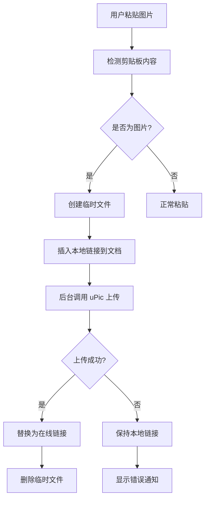
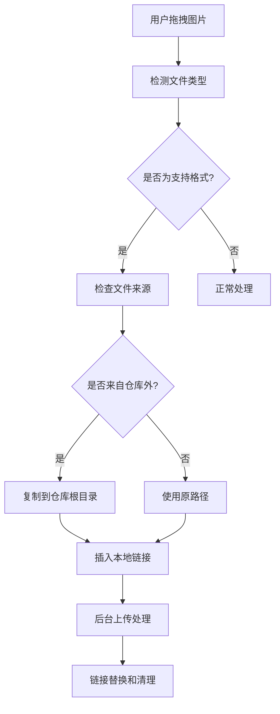

# 开发文档

本文档为 Obsidian uPic 自动上传插件的开发者提供详细的技术信息和开发指南。

## 🏗️ 项目架构

### 技术栈
- **前端框架**: Obsidian Plugin API
- **开发语言**: TypeScript
- **构建工具**: ESBuild
- **包管理**: npm
- **外部依赖**: uPic (图床工具)

### 项目结构
```
obsidian-upic-auto-uploader/
├── src/                        # 源代码目录
│   ├── types.ts               # TypeScript 类型定义
│   ├── upic-uploader.ts       # uPic 集成核心模块
│   ├── settings-manager.ts    # 设置管理器
│   ├── settings-tab.ts        # 设置界面组件
│   └── commands.ts            # 命令管理器
├── main.ts                    # 插件主入口文件
├── manifest.json              # 插件清单文件
├── styles.css                 # 样式文件
├── package.json               # 项目配置
├── tsconfig.json              # TypeScript 配置
├── esbuild.config.mjs         # 构建配置
├── version-bump.mjs           # 版本管理脚本
└── versions.json              # 版本历史记录
```

## 🔧 开发环境设置

### 前置要求
- Node.js 16.x 或更高版本
- npm 或 yarn
- TypeScript 4.7+
- Obsidian (用于测试)

### 快速开始
```bash
# 克隆项目
git clone https://github.com/your-username/obsidian-upic-auto-uploader.git
cd obsidian-upic-auto-uploader

# 安装依赖
npm install

# 开发模式（监听文件变化）
npm run dev

# 生产构建
npm run build

# 版本更新
npm run version
```

### 开发模式设置
1. **符号链接到 Obsidian 插件目录**
   ```bash
   # macOS/Linux
   ln -s $(pwd) ~/.config/obsidian/plugins/obsidian-upic-auto-uploader
   
   # Windows
   mklink /D "%APPDATA%\Obsidian\plugins\obsidian-upic-auto-uploader" "%CD%"
   ```

2. **启用热重载**
   - 运行 `npm run dev` 启动监听模式
   - 修改代码后自动重新构建
   - 在 Obsidian 中禁用并重新启用插件以加载更改

## 📋 核心模块详解

### 1. UPicUploader (upic-uploader.ts)
**职责**: uPic 集成和文件上传处理

**核心方法**:
- `uploadFile(filePath: string)`: 上传单个文件
- `uploadFromClipboard()`: 上传剪贴板图片
- `processDroppedImageFile()`: 处理拖拽的图片文件
- `replaceImageLinkInDocument()`: 替换文档中的图片链接

**关键特性**:
- 异步文件上传处理
- 智能文件路径管理
- 安全的本地文件删除机制
- 完善的错误处理和重试逻辑

### 2. SettingsManager (settings-manager.ts)
**职责**: 插件配置管理

**核心功能**:
- 配置的加载和保存
- 默认配置管理
- 配置验证和迁移
- 导入/导出功能

### 3. CommandManager (commands.ts)
**职责**: 命令注册和处理

**注册的命令**:
- `upload-selected-image`: 上传选中的图片
- `upload-clipboard-image`: 上传剪贴板图片
- `upload-all-images`: 批量上传所有本地图片
- `toggle-auto-upload`: 切换自动上传功能
- `test-upic-quick`: 快速测试 uPic 可用性
- `test-upic-detailed`: 详细测试 uPic 配置
- `diagnose-upic`: 生成完整诊断报告

### 4. SettingsTab (settings-tab.ts)
**职责**: 设置界面渲染和交互

**界面组件**:
- uPic 路径配置
- 自动上传开关
- 超时时间设置
- 文件格式限制
- 诊断工具按钮
- 配置导入/导出

## 🔄 核心工作流程

### 自动上传流程


### 拖拽上传流程


## 🛠️ 开发最佳实践

### 代码规范
1. **TypeScript 严格模式**: 启用所有严格检查
2. **错误处理**: 所有异步操作都要有适当的错误处理
3. **日志记录**: 使用 `console.log` 进行调试，生产环境可配置日志级别
4. **类型安全**: 避免使用 `any`，定义明确的接口和类型

### 文件管理原则
1. **安全第一**: 绝不删除用户的原始文件
2. **路径检查**: 只操作仓库内的文件
3. **临时文件**: 及时清理临时文件
4. **权限检查**: 操作文件前检查权限

### 用户体验
1. **非阻塞操作**: 所有上传操作都在后台进行
2. **进度反馈**: 提供清晰的状态通知
3. **错误恢复**: 上传失败时保持本地链接
4. **配置验证**: 实时验证用户配置

## 🧪 测试策略

### 单元测试
```bash
# 运行测试（如果配置了测试框架）
npm test
```

### 手动测试清单
- [ ] 自动上传功能
- [ ] 拖拽上传功能
- [ ] 批量上传功能
- [ ] 快捷键操作
- [ ] 设置界面交互
- [ ] 错误处理和恢复
- [ ] 不同文件格式支持
- [ ] 网络异常情况

### 集成测试
1. **uPic 集成测试**
   ```bash
   # 测试 uPic 命令行
   /Applications/uPic.app/Contents/MacOS/uPic --help
   ```

2. **Obsidian 插件测试**
   - 在不同版本的 Obsidian 中测试
   - 测试与其他插件的兼容性
   - 验证插件加载和卸载

## 📦 构建和发布

### 构建配置 (esbuild.config.mjs)
```javascript
import esbuild from "esbuild";
import process from "process";
import builtins from "builtin-modules";

const banner = `/*
THIS IS A GENERATED/BUNDLED FILE BY ESBUILD
if you want to view the source, please visit the github repository of this plugin
*/`;

const prod = (process.argv[2] === "production");

const context = await esbuild.context({
	banner: {
		js: banner,
	},
	entryPoints: ["main.ts"],
	bundle: true,
	external: [
		"obsidian",
		"electron",
		"@codemirror/autocomplete",
		"@codemirror/collab",
		"@codemirror/commands",
		"@codemirror/language",
		"@codemirror/lint",
		"@codemirror/search",
		"@codemirror/state",
		"@codemirror/view",
		"@lezer/common",
		"@lezer/highlight",
		"@lezer/lr",
		...builtins],
	format: "cjs",
	target: "es2018",
	logLevel: "info",
	sourcemap: prod ? false : "inline",
	treeShaking: true,
	outfile: "main.js",
});

if (prod) {
	await context.rebuild();
	process.exit(0);
} else {
	await context.watch();
}
```

### 版本管理
```bash
# 更新版本号
npm run version

# 手动更新 manifest.json 和 versions.json
# 提交更改
git add .
git commit -m "Release v1.x.x"
git tag v1.x.x
git push origin main --tags
```

### 发布清单
- [ ] 更新版本号
- [ ] 更新 CHANGELOG.md
- [ ] 运行完整测试
- [ ] 构建生产版本
- [ ] 创建 GitHub Release
- [ ] 上传构建文件
- [ ] 更新文档

## 🐛 调试技巧

### 开发者工具
1. **启用控制台日志**
   ```typescript
   // 在代码中添加调试日志
   console.log('Debug info:', data);
   console.error('Error occurred:', error);
   ```

2. **使用 Obsidian 开发者工具**
   - 按 `Cmd/Ctrl + Shift + I` 打开
   - 查看 Console 标签页的输出
   - 使用 Network 标签监控网络请求

### 常见调试场景
1. **uPic 路径问题**
   ```typescript
   // 添加路径验证日志
   console.log('uPic path:', this.settings.upicPath);
   console.log('Path exists:', fs.existsSync(this.settings.upicPath));
   ```

2. **文件上传失败**
   ```typescript
   // 记录上传过程
   console.log('Uploading file:', filePath);
   console.log('uPic command:', command);
   console.log('uPic output:', result);
   ```

## 🤝 贡献指南

### 提交代码
1. Fork 项目仓库
2. 创建功能分支 (`git checkout -b feature/amazing-feature`)
3. 提交更改 (`git commit -m 'Add amazing feature'`)
4. 推送到分支 (`git push origin feature/amazing-feature`)
5. 创建 Pull Request

### 代码审查
- 确保代码符合项目规范
- 添加必要的测试
- 更新相关文档
- 通过所有 CI 检查

### 问题报告
- 使用问题模板
- 提供详细的复现步骤
- 包含系统环境信息
- 附上相关日志和截图

---

**开发愉快！如有问题，欢迎在 GitHub Issues 中讨论。** 🚀